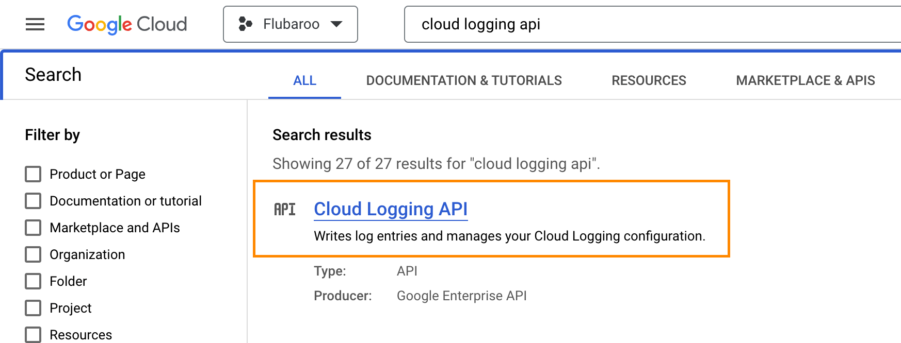

# Instructions for creating a usage dashboard for your Google Workspace Add-on
By: Dave Abouav
 
Last Updated: October 16, 2023

At the moment, Add-ons in Google Workspace offer only basic usage analytics via the [Workspace Marketplace SDK](https://console.cloud.google.com/apis/api/appsmarket-component.googleapis.com/googleapps_sdk_dashboard). These include install data broken out by domains and seats (for Add-ons installed by Workspace admins), and individual end-user installs. This is useful information, but doesn't tell you much about who is actively using your Add-on, nor give you the ability to breakdown that usage by different dimensions.

The code and instructions in this repo will help you gather and visualize Add-on usage data, such as active usage of your Add-on broken out by user characteristics. It also shows you how to log specific events that correspond to use you want to track (i.e. new installs, uses of particular features, etc). You can copy/paste the contents of <code>dashboard.gs</code> into your Apps Script project to get started.

## Step 1: Requirements and Initial Setup

### Requirements
We make the assumption here that you already have a published Add-on in the Workspace Marketplace, and hence also a GCP project with billing enabled. 

This project requires use of Google BigQuery, which is not free to use (unlike Workspace APIs). While the cost is not typically high (a few dollars a month in my experience), you should be aware that it is not free and your billing account should be up-to-date as it will be charged. Note that Google sometimes offers up to $300 in free credits, which you could apply towards this accured cost.

The code in <code>dashboard.gs</code> assumes you have a user's timezone and locale accessible (stored in user properties). If you don't already have a way to collect or store these, you can comment out the relevant lines that retrieve them, as well as their use in the objects passed to console.log(). You'll also need to remove references to them in the BigQuery queries shown later in these instructions. Note that if you do this, you won't be able to partition your data by the user's country.</li>

The code calls MailApp.getRemainingDailyQuota() as part of determining if the user is a regular consumer user (i.e. @gmail.com), versus a Google Workspace user. This will result in the scope <code>https://www.googleapis.com/auth/script.send_mail</code> being requested. If you don't want your app to request this scope, you'll need to delete the code related to <code>isWorkspaceUserAccount</code>, as well as references to the in the BigQuery queries shown later in these instructions.

### Initial Setup
To start, make sure to enable the Cloud Logging API in GCP for your project. You can find this API by searching for it in the Cloud Console, like so:
 

## Step 2: Add Logging to Your Add-on

### Add Active Usage Logging

### Add Event Logging

## Step 3: Route Logs to BigQuery

### Route Active Usage Logs

### Route Event Logs

## Step 4: Create and Schedule BigQuery Queries

### Active Usage BigQuery Query

### Events BigQuery Query

## Step 5: Dashboards in Looker Studio

### Active Usage Dashboard Page

### Events Dashboard Page

### Specific Event Drilldown Dashboard Page

...

## Step 3: Routing Data
