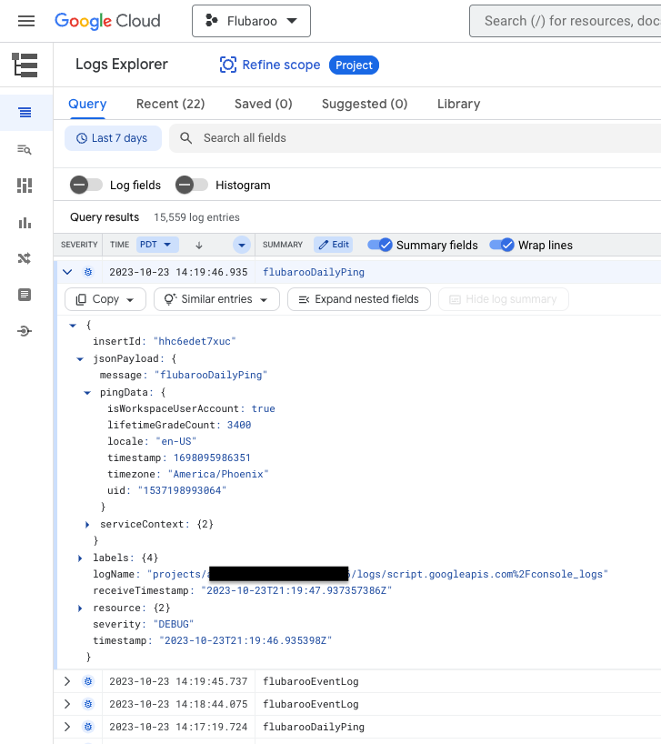
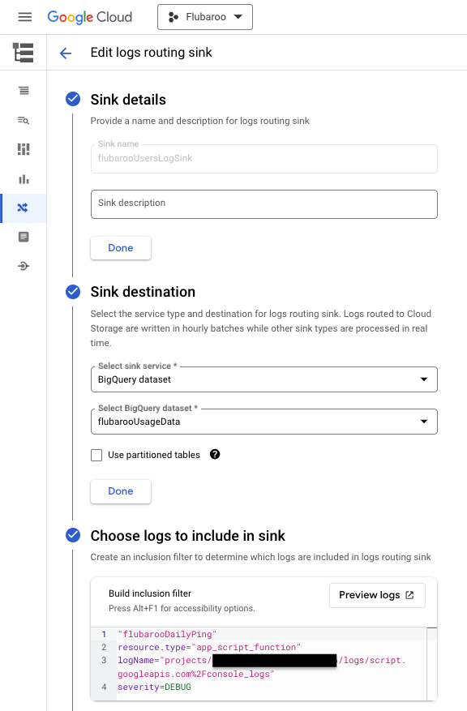
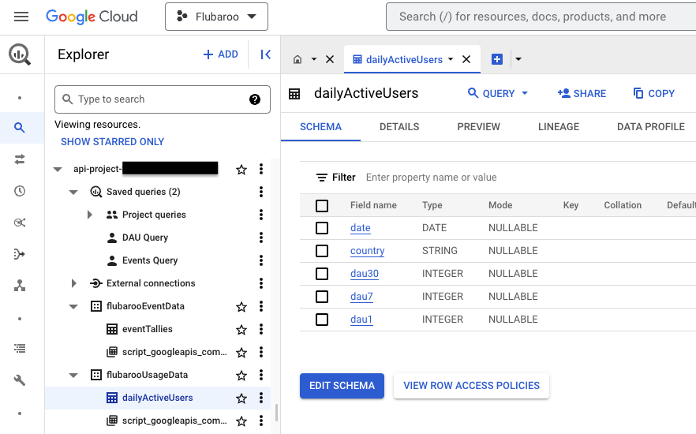
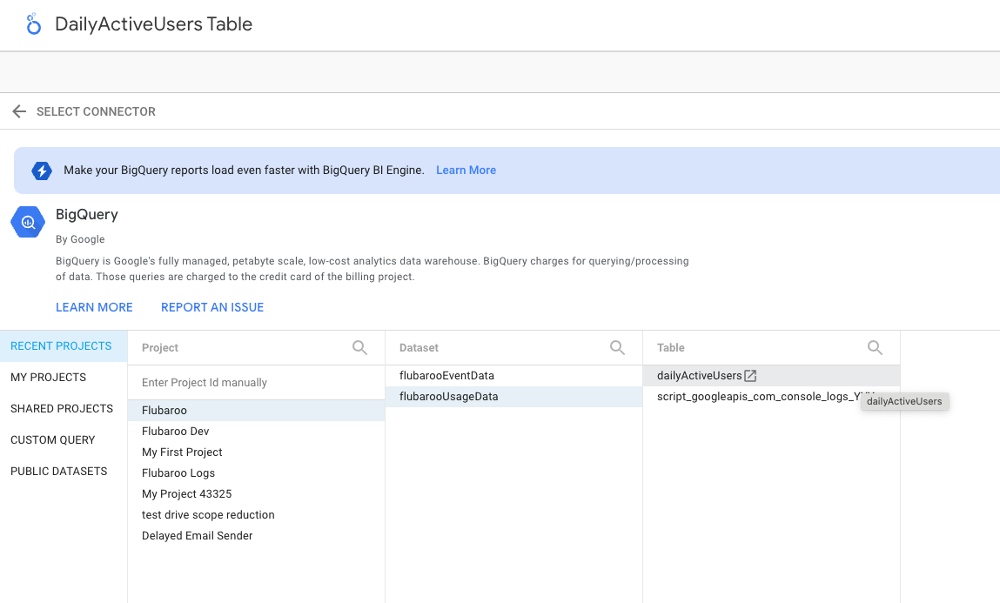

# Instructions for creating a usage dashboard for your Google Workspace Add-on
By: Dave Abouav
<br>
Last Updated: October 30, 2023

At the moment, Add-ons in Google Workspace offer only basic usage analytics via the [Workspace Marketplace SDK](https://console.cloud.google.com/apis/api/appsmarket-component.googleapis.com/googleapps_sdk_dashboard). These include install data broken out by domains and seats (for Add-ons installed by Workspace admins), and individual end-user installs. This is useful information, but doesn't tell you much about who is actively using your Add-on, nor give you the ability to breakdown that usage by different dimensions.

The code and instructions in this repo will help you gather and visualize Add-on usage data, such as active usage of your Add-on broken out by user characteristics. It also shows you how to log specific events that correspond to use you want to track (i.e. new installs, uses of particular features, etc). You can copy the contents of <code>dashboard.gs</code> into your Apps Script project to get started. This project was developed to help me study use of my [open-source](https://github.com/edcodeorg/flubaroo), Sheets Add-on [Flubaroo](https://workspace.google.com/marketplace/app/flubaroo/817638980086), which lets teachers grade assignments. Hence you'll see references to "grading assignments" in my description below when discussing app-specific logging. The majority of the code and examples given are generic though, and can be used for any Add-on.

## Step 1: Requirements and Initial Setup

### Requirements
We make the assumption here that you already have a published Add-on in the Workspace Marketplace, and hence also a GCP project with billing enabled. You should also have access to a Google Cloud Identity or Workspace account that has access to the [Google Cloud Console](https://console.cloud.google.com).

This project requires use of Google BigQuery, which is not free to use (unlike Workspace APIs). While the cost is not typically high (a few dollars a month in my experience), you should be aware that it is not free and your billing account should be up-to-date as it will be charged. Note that Google Cloud sometimes offers up to $300 in free credits, which you could apply towards this accured cost. While in general there _can_ be costs associated with long-term logs storage, we'll be using the default log expiration window of 30 days, which is free.

You will also need Google Cloud IAM permissions in this GCP project to enable the Cloud Logging API, create Logging Sinks, and create a BigQuery dataset in which you can create and write to tables, as well as create and schedule queries. If you don't have this type of GCP access, you can ask someone who does to follow these steps on your behalf. You will only need to be granted read access to the final BigQuery tables that are used to generate dashboards in Looker Studio.

### Initial Setup
To start, make sure to enable the Cloud Logging API in GCP for your project. You can find this API by searching for it in the Cloud Console, like so:
<br><br>


## Step 2: Add Logging to Your Add-on

### Customize the Code
You should copy <code>dashboard.gs</code> into your project and customize it according to the instructions below:
<ul>
  <li>Change the const variable <code>addOnName</code> to be a string that identifies your Add-on. This string will appear in Cloud Logging, and will be needed to distinguish this Add-on from any others you may have that you wish to have a separate dashboard for. </li>
  <li>The code in <code>dashboard.gs</code> assumes you have a user's timezone accessible (stored in user properties). If you don't already have a way to collect or store this, you can just edit the function <code>_getUserTimezone()</code> to return a string like <code>"unknown"</code>.</li>
  <li>The code calls MailApp.getRemainingDailyQuota() as part of determining if the user is a regular consumer user (i.e. @gmail.com), versus a Google Workspace user. This will result in the scope <code>https://www.googleapis.com/auth/script.send_mail</code> being requested. If you don't want your app to request this scope, you'll need to delete the code related to <code>isWorkspaceUserAccount</code>, as well as references to the in the BigQuery queries shown later in these instructions.
</li>
</ul>

### Add Active Usage Logging
Place a call to <code>logDailyPing()</code> somewhere in your code. The function takes no arguments. Because this is used to track daily active usage, you should consider what "active usage" means for your app and place it in a related part of your code. For example, in Flubaroo I consider "active usage" to be only when an assignment gets graded, versus just when a user loads the Sheet or clicks a menu. Hence I placed my call to logDailyPing() in the function that's called when grading takes place. This same function is called both when the teacher grades the assignment by clicking a menu item, as well as when grading happens automatically (on Google Form submission). Hence anytime an assignment gets graded, regardless of what triggered it, that usage is tracked. You may wish to track active usage differently, and may even choose to place calls <code>logDailyPing()</code> in more than one location, which is fine. The tracking that results from <code>logDailyPing()</code> will only happen once per 24 hour period, so there is no problem if it gets called multiple times per day.

### Add Event Logging
The function <code>logEvent(eventName, eventSpecificDetails)</code> logs details about a specific event that took place during the execution of your Add-on, so call it wherever and whenever you wish to track an event. For example, you could call it to record when a user first installs your Add-on, or when they take a certain action like making a selection or processing a file. For example, in Flubaroo I call it to track the first time a user installs Flubaroo, and whenever an assignment is graded.

The first argument <code>eventName</code> is a string that identifies the event being logged. The string can be anything, but be sure you use it for this event type only. That is, have a unique event name for each type of event you wish to log, and use it consistently.

The second argument <code>eventSpecificDetails</code> is an optional object with details you wish to log related to the specific event. If no details are to be logged, pass the second argument as null, or simply don't pass at all. <b>Note</b>: Only object fields of type 'string', 'number', and 'boolean' are supported for logging purposes (others are skipped).

Here's an example of how you might log an event that takes place when a user first installs your Add-on (i.e. a new user):
<code>logEvent('EVENT_FIRST_INSTALL')</code>

Here's an example of how you might log an event that takes place when your Add-on has successfully processed a file:
<code>logEvent('EVENT_FILE_PROCESSED', {'fileName': 'report.pdf', 'fileSizeKB': 68.8})</code> 

Once your calls are in place, you should confirm see the corresponding logs entries in Google Cloud [Logs Explorer](https://console.cloud.google.com/logs/query). If you don't see them, be sure you're checking logs for the correct GCP project, have waited a minute or two for the logs entries to show up, and have the correct time window set. As an example, a Flubaroo log entry from <code>logDailyPing()</code> is shown in the image below. Note that the actual usage data is in the jsonPayload object:
<br><br>



## Step 3: Route Logs to BigQuery
In order for your Active Usage and Event Logging to end-up in BigQuery for analysis, we'll need to setup Log Routing. This is done from the Google Cloud [Log Router](https://console.cloud.google.com/logs/router).

### Route Active Usage Logs
On the Log Router page, click "Create sink". For the information requested, enter the following information in each of the sections:
<ul>
  <li><b>Sink details:</b>
    <ul>
      <li><b>Sink name:</b> <code>addOnName</code> + "UsageLogSink" (i.e. <code>flubarooUsageLogSink</code>)</li>      
    </ul>
  </li>
  <li><b>Sink destination:</b>
    <ul>
      <li><b>Select sink service:</b> BigQuery dataset</li>
      <li><b>Select BigQuery dataset:</b></li>
      <ul>
        <li>Select "Create new BigQuery dataset"</li>
        <li>In the "Create dataset" panel that opens, enter a dataset ID such as <code>addOnName</code> + "UsageData"</code> (i.e. <code>flubarooUsageData</code>). Remember this data set name as you'll reference it again later when setting up your BigQuery query.</li>
        <li>Ensure "Enable table expiration" is <b>not</b> checked.</li>
        <li>Accept all other defaults and create the dataset.</li>
      </ul>
    </ul>
  </li>
  <li><b>Choose logs to include in sink:</b>
    <br>Copy/paste the filter shown below into the "inclusion filter" box, but replace "flubarooDailyPing" with <code>addOnName</code> + "DailyPing", and replace "&lt;project-id-your-project-id-here&gt;" with the ID of your GCP project.
  </li>
</ul>

Click "Create Sink". If you encounter errors trying to create the BigQuery dataset, or the new sink, ensure that you have all of the necessary IAM permissions, and have enabled Cloud Logging API in your project.<br>

Inclusion Filter:
```
"flubarooDailyPing"
resource.type="app_script_function"
logName="projects/<project-id-your-project-id-here>/logs/script.googleapis.com%2Fconsole_logs"
severity=DEBUG
```

### Route Event Logs
Repeat the same exact steps in "Route Active Usage Logs" above, but with these changes:
<ul>
  <li>For "Sink name", use <code>addOnName</code> + "EventLogSink" (i.e. <code>flubarooEventLogSink</code>)</li>      
  <li>When creating a new BigQuery dataset, enter a dataset ID such as <code>addOnName</code> + "EventData"</code> (i.e. <code>flubarooEventData</code>)</li>
  <li>For the inclusion filter, change the first line from "flubarooDailyPing" to <code>addOnName</code> + "EventLog" (i.e. <code>flubarooEventLog</code>)</li>                      </ul>

Here is an example of Flubaroo's Active Usage log routing sink:
<br><br>



## Step 4: Create and Schedule BigQuery Queries
Next we'll want to create 2 BigQuery queries, and schedule them to run daily. To get started, visit the (BigQuery Studio) [https://console.cloud.google.com/bigquery] page in the GCP console, and make sure your project is selected in the project selector at the top.

### Active Usage BigQuery Query
Click the "Compose a New Query" button to start a blank query. Copy the contents of [dauQuery.txt](/dauQuery.txt) file in this repository, and paste the contents into the query. Save the query with a name like "DAU Query", but don't run the query yet. 

At the top of the query are instructions to replace the Project ID and Table Set name. Review them, then use the query editor's search and replace tool (Control+F on PC or Chrome OS, Command+F on Mac) to replace the occurrences of <code>&lt;your-gcp-project-id&gt;</code> and <code>&lt;yourDatSetName&gt;</code>.

Save the query again, then run it. If it fails to execute, be sure you copy/pasted it correctly, and correctly indicated the name of your GCP Project (it should be the same one that your Add-on is associated with), and the name of your data set (this is the same data set you created when setting up log routing).

Once it executes successfully, you should notice a new BigQuery Data Set and Table, similar to the ones shown below:
<br><br>


Next, search for the line that starts with "CREATE OR REPLACE TABLE". Comment out this line by adding two dashes (--) infront of it. On the line immediately following, remove the two dashes that precede the word "INSERT". Once done, save your change. Now when the script runs in the future, it will insert new data in the table you just created, rather than creating a new table each time it runs.

Finally, you'll need to schedule this query to run each day. To do so, click the "Schedule" button at the top of the query editor. In the "New scheduled query" pane that opens, enter the following:
<ul>
  <li>Give your query a name, like "Scheduled DAU Query".</li>
  <li>For the "Schedule options" section, select a "Repeat frequency" value of "Days".</li>
  <li>For the "Schedule options" section, select a "At" time of your choosing. Note that because this determines the approximate time your query will run, it also determines the ending time window used when evaluating logs for that day's table entries. For example, if you select a start time of 12:00 UTC, then your daily active users (1DAU) for that day will be those with log entry timestamps from 12:00:00 UTC on the day the script runs, back to 12:00:00 UTC the previous day.</li>
  <li>Ensure the script is configured to "Start now" and "End never".</li>
  <li>Leave all other fields with their default value. In particular, do <b>not</b> choose to "Set a destination table for query results", as this is already taken care of in the query.</li>
</ul>

Once configured, click "Save". You can see your scheduled query in the [Scheduled Queries](https://console.cloud.google.com/bigquery/scheduled-queries)  section of BigQuery. Note that the scheduled makes a _copy_ of your query at the time of schedule creation. So if you make changes to your query in the future you will need to delete the old scheduled query and then create a new schedule.

### Event BigQuery Query
As in the prior section, click the "Compose a New Query" button to start a blank query. This time copy the contents of [eventsQuery.txt](/eventsQuery.txt) file in this repository, and paste the contents into the query. Save the query with a name like "Events Query", but don't run the query yet. 

At the top of the query are instructions to replace the Project ID and Table Set name. Review them, then use the query editor's search and replace tool (Control+F on PC or Chrome OS, Command+F on Mac) to replace the occurrences of <code>&lt;your-gcp-project-id&gt;</code> and <code>&lt;yourDatSetName&gt;</code>.

Save the query again, then run it. If it fails to execute, be sure you copy/pasted it correctly, and correctly indicated the name of your GCP Project (it should be the same one that your Add-on is associated with), and the name of your data set (this is the same data set you created when setting up log routing).

Once it executes successfully, you should notice a new BigQuery Data Set and Table, similar to the ones shown in the image in the prior section above.

Next, search for the line that starts with "CREATE OR REPLACE TABLE". Comment out this line by adding two dashes (--) infront of it. On the line immediately following, remove the two dashes that precede the word "INSERT". Once done, save your change. Now when the script runs in the future, it will insert new data in the table you just created, rather than creating a new table each time it runs.

Finally, you'll need to schedule this query to run each day. To do so, click the "Schedule" button at the top of the query editor. In the "New scheduled query" pane that opens, enter the following:
<ul>
  <li>Give your query a name, like "Scheduled Events Query".</li>
  <li>For the "Schedule options" section, select a "Repeat frequency" value of "Days".</li>
  <li>For the "Schedule options" section, select a "At" time of your choosing. Note that because this determines the approximate time your query will run, it also determines the ending time window used when evaluating logs for that day's table entries. For example, if you select a start time of 12:00 UTC, then your events included for that day will be those with log entry timestamps from 12:00:00 UTC on the day the script runs, back to 12:00:00 UTC the previous day.</li>
  <li>Ensure the script is configured to "Start now" and "End never".</li>
  <li>Leave all other fields with their default value. In particular, do <b>not</b> choose to "Set a destination table for query results", as this is already taken care of in the query.</li>
</ul>

Once configured, click "Save". You can see your scheduled query in the [Scheduled Queries](https://console.cloud.google.com/bigquery/scheduled-queries)   section of BigQuery. Note that the scheduled makes a _copy_ of your query at the time of schedule creation. So if you make changes to your query in the future you will need to delete the old scheduled query and then create a new schedule.


## Step 5: Creating Dashboards in Looker Studio

[LookerStudio](https://lookerstudio.google.com) (formerly DataStudio) is a free tool from Google for visualizing data and sharing reports or dashboards. It can connect to a variety of data sources, including BigQuery tables. This section discusses how to set up dashboard in Looker Studio to visualize Active Usage and Events for your Add-on.

### Setup Data Sources and Report

In [LookerStudio](https://lookerstudio.google.com), choose "Create > Data source". Select "BigQuery" as the type of data source. You will be asked to authorize access, and select the GCP project associated with your BigQuery tables. After selecting it, you should see the BigQuery Datasets you created in Step 4. Select the one associated with Active Usage, and then click on the name of the table in that Dataset (<code>dailyActiveUsers</code>). Your selection should look similar to this:



Be sure to give it a name (i.e. "DailyActiveUsers Table" in the top-left. Click "Connect" in the top-right once ready to add this Data source to your Looker Studio instance.

Repeat this process a second time for the Event Tallies table.

Finally, from the LookerStudio home page click "Create > Report". You will be prompted to add data to the report. Click the "My data sources" tab and select one the 2 tables you just added as Data Sources. Once you add it you will be dropped into the LookerStudio report editor. To add the other table as a data source for this report, click on the "Add data" button in the editor's toolbar and follow the same process again for ther other table.

### Active Usage Dashboard Page


### Event Dashboard Page

### Specific Event Drilldown Dashboard Page


